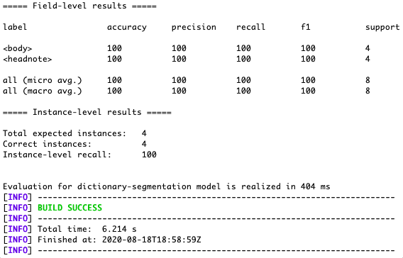
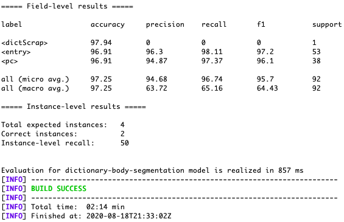
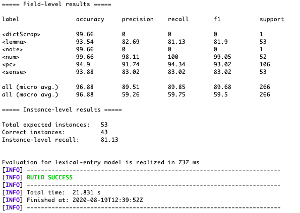
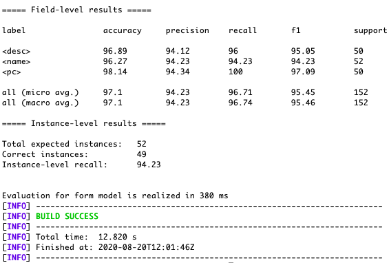
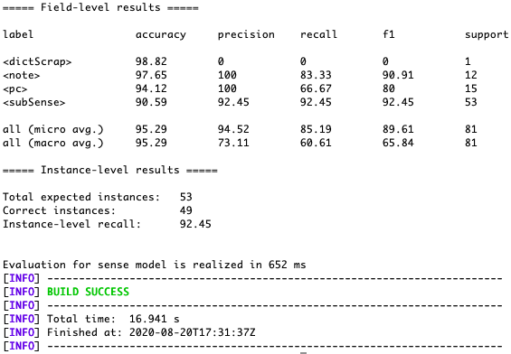
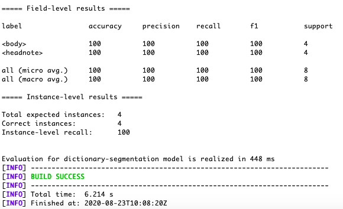
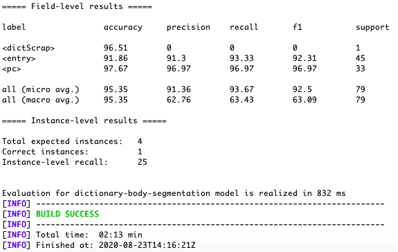
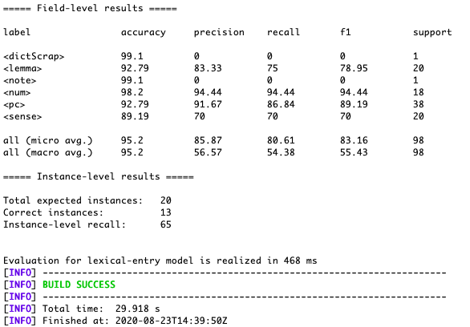
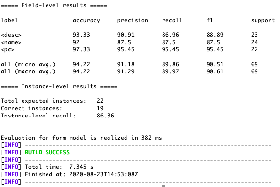
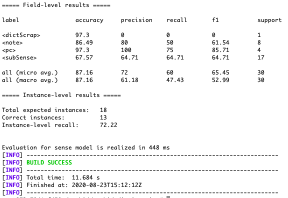

# Training the *GROBID*-dictionaries with the ALTO-XML files

The main idea is to train two _GROBID-dictionaries_ models:

* one using the markup tags `<b>` (bold) and `<i>` (italic);
* the other without the typographical information,

on the fixed-price catalogues published by:

* Jacques Charavay (hereinafter `LAC`);
* Auguste Laverdet (hereinafter `LAV`);

in the ALTO-XML format.

### Sampling criteria

For each type of catalogue we sample the oldest and the most recent publications.

The catalogues were divided into two subsets: the training set containing 4 pages, and the validation set containing 1 page.

**N.B.:** In order to have a sufficient number of pages from the oldest releases of the `LAC` catalogues containing the information about the manuscrips sales, we combined one page from the catalogue released in November 1845 (Nº4) and four pages from the one released on the 1st January 1846 (Nº5).   

### Annotation 

We have annotated the catalogues on 5 levels:

1. `dictionary-segmentation` level with the `<headline>` and `<body>` tags;

### Training results

#### 1. With the typographical information

Results after training the model on the `LAC` and the `LAV` catalogues, at five granularity levels:

a) **`dictionary-segmentation`:**

 

 

b) **`dictionary-body-segmentation`:**

 

c) **`lexical-entry`:**

 

d) **`form`:**

 

e) **`sense`:**

#### 2. Without the typographical information

a) **`dictionary-segmentation`:**

 

b) **`dictionary-body-segmentation`:**

Results after training the model on the `LAC` catalogues:

a) **`dictionary-segmentation`:**

 

b) **`dictionary-body-segmentation`:**

 

c) **`lexical-entry`:**

 

d)  **`form`:**

 

e)  **`sense`:**

#### ### Conclusion

In terms of precision and F1 measure:

`dictionary-segmentation`: no changes

`dictionary-body-segmentation`: better results with the typographical information for `<entry>`

`lexical-entry`: better precision with the typographical information for `<lemma>` and `<note>`, but not for `<sense>`;

`form`: better precision with the typographical information for `<desc>` and `<name>`;

`sense`: better precision with the typographical information for `<note>` and `<subSense>`.