# Training the *GROBID*-dictionaries with the ALTO-XML files

The main idea is to train two _GROBID-dictionaries_ models:

* one using the markup tags `<b>` (bold) and `<i>` (italic);
* the other without the typographical information,

on the fixed-price catalogues published by:

* Jacques Charavay (hereinafter `LAC`);
* Auguste Laverdet (hereinafter `LAV`);

in the ALTO-XML format.

### Sampling criteria

For each type of catalogue we sample the oldest and the most recent publications.

The catalogues were divided into two subsets: the training set containing 4 pages, and the validation set containing 1 page.

**N.B.:** In order to have a sufficient number of pages from the oldest releases of the `LAC` catalogues containing the information about the manuscrips sales, we combined one page from the catalogue released in November 1845 (Nº4) and four pages from the one released on the 1st January 1846 (Nº5).   

### Annotation 

We have annotated the catalogues on 5 levels:

1. `dictionary-segmentation` level with the `<headline>` and `<body>` tags;

### Training results

#### 1. With the typographical information

Results after training the model on the `LAC` and the `LAV` catalogues, at five granularity levels:

a) **`dictionary-segmentation`:**

 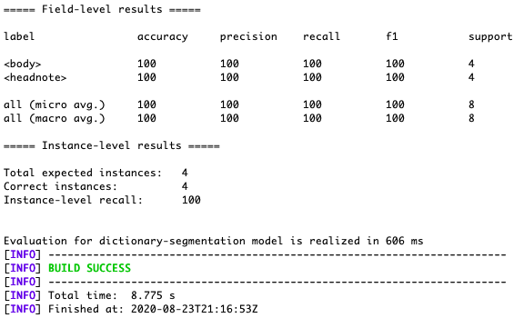

 

b) **`dictionary-body-segmentation`:**

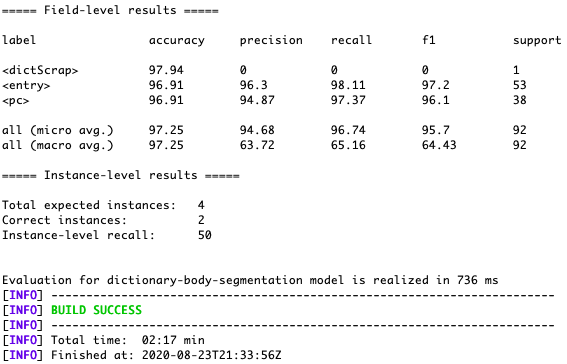

 

c) **`lexical-entry`:**

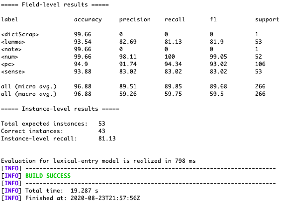

 

d) **`form`:**

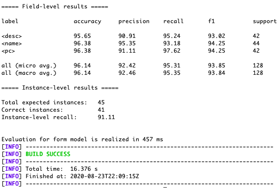

 

e) **`sense`:**

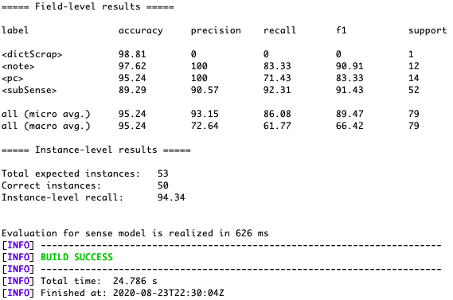

#### 2. Without the typographical information

a) **`dictionary-segmentation`:**

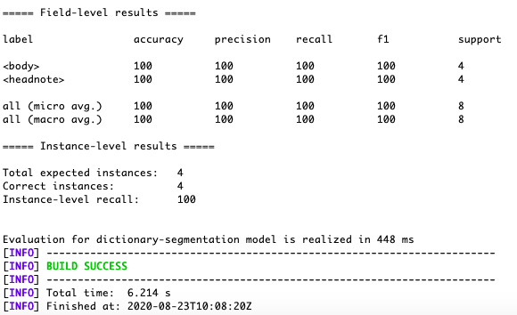

 

b) **`dictionary-body-segmentation`:**

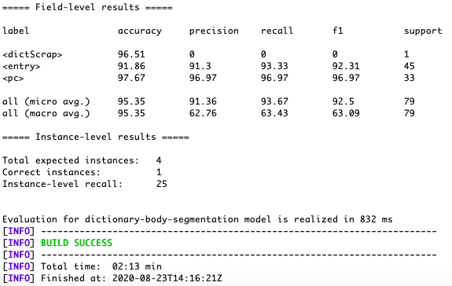

 

c) **`lexical-entry`:**

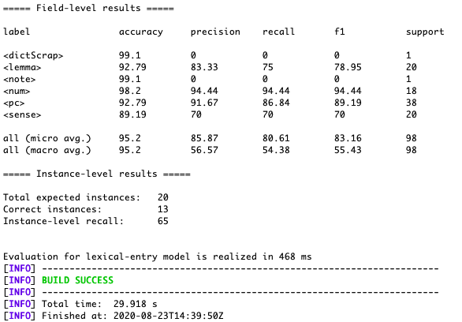

 

d)  **`form`:**

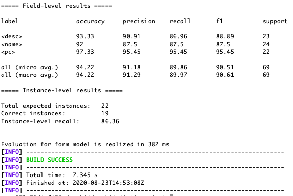

 

e)  **`sense`:**

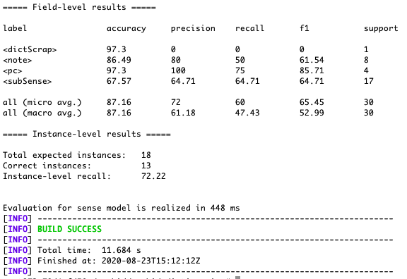

### 1st conclusion 

In terms of precision and F1 measure:

`dictionary-segmentation`: no changes

`dictionary-body-segmentation`: better results **with** the typographical information for `<entry>`

`lexical-entry`: better precision **without** the typographical information for `<lemma>` (but better precision **with** the typographical information for `<sense>`), but better F1-measure for the aforementioned tags **with** the typographical information;

`form`: equal precision for `<desc>`, but better F1-measure for the same tag **with** the typographical information; better results **with** the typographical information for `<name>`;

`sense`: better results **with** the typographical information for `<note>` and `<subSense>`.

 

### Results after training the model on the `LAC` catalogues:

#### With the typographical information

a) **`dictionary-segmentation`:**

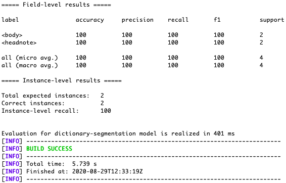

 

b) **`dictionary-body-segmentation`:**

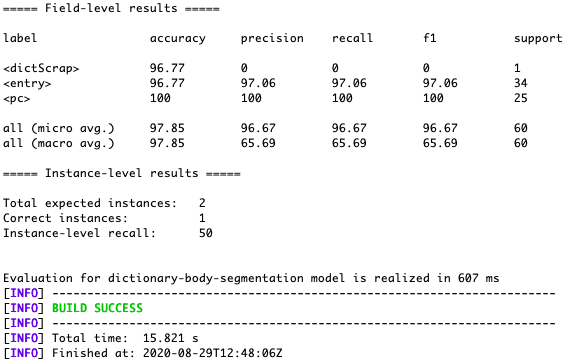

 

c) **`lexical-entry`:**

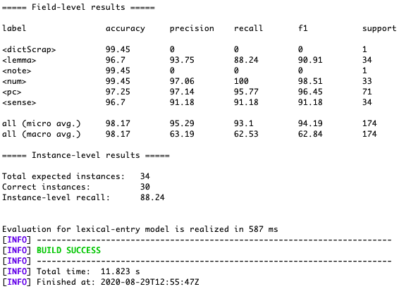

 

d) **`form`:**

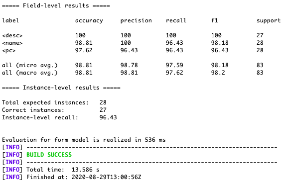

 

e) **`sense`:**

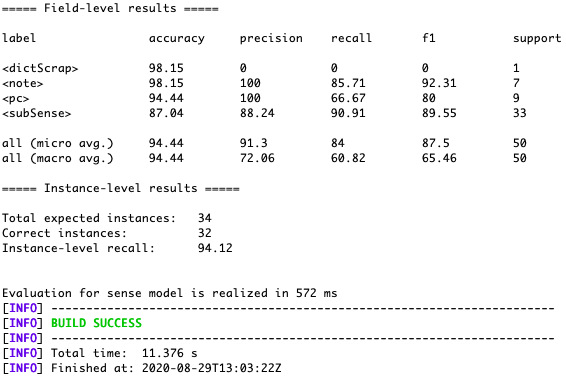

#### Without the typographical information

a) **`dictionary-segmentation`:**

 

b) **`dictionary-body-segmentation`:**

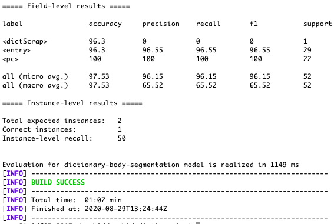

 

c) **`lexical-entry`:**

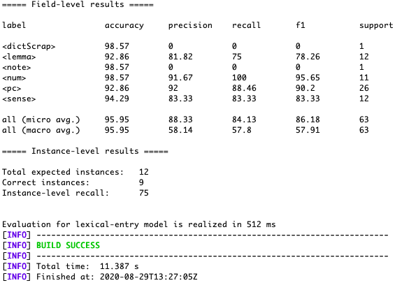

 

d) **`form`:**

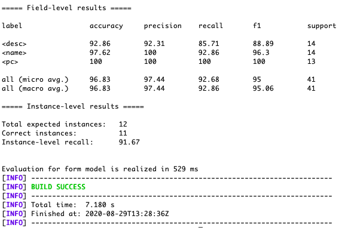

 

e) **`sense`:**

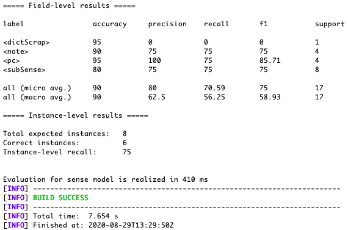

### 2nd conclusion 

In terms of precision and F1 measure:

`dictionary-segmentation`: no changes

`dictionary-body-segmentation`: better results **with** the typographical information for `<entry>`

`lexical-entry`: better results **without** the typographical information for `<lemma>` and `<sense>`;

`form`: better precision and F1-measure for `<desc>`, equal precision `<name>` and better F1-measure for the same tag **with** the typographical information; 

`sense`: better results **with** the typographical information for `<note>` and `<subSense>`.

### Results after training the model on the `LAV` catalogues:

#### With the typographical information

a) **`dictionary-segmentation`:**

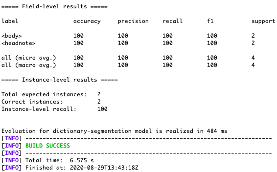

 

b) **`dictionary-body-segmentation`:**

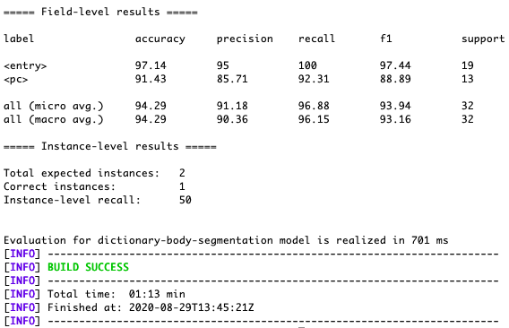

 

c) **`lexical-entry`:**

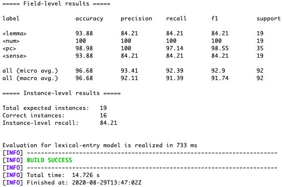

 

d) **`form`:**

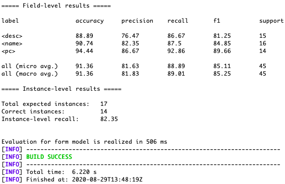

 

e) **`sense`:**

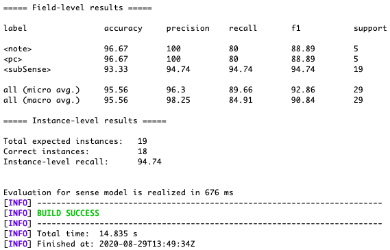

#### Without the typographical information

a) **`dictionary-segmentation`:**

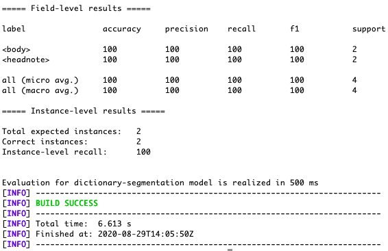

 

b) **`dictionary-body-segmentation`:**

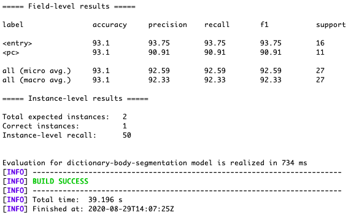

 

c) **`lexical-entry`:**

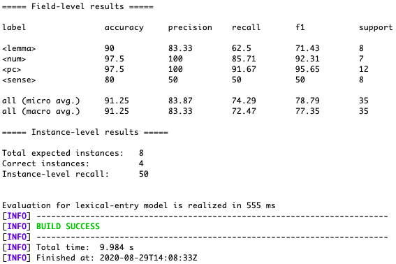

 

d) **`form`:**

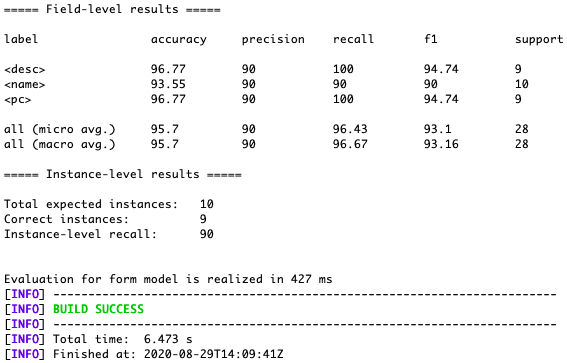

 

e) **`sense`:**

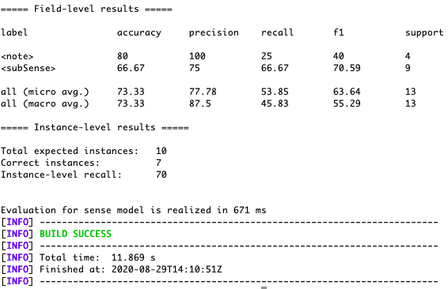

### 3rd conclusion 

In terms of precision and F1 measure:

`dictionary-segmentation`: no changes

`dictionary-body-segmentation`: better results **with** the typographical information for `<entry>`

`lexical-entry`: better results **with** the typographical information for `<lemma>` and `<sense>`;

`form`: better precision and F1-measure for `<desc>` and `<name>` **without** the typographical information; 

`sense`: equal precision and better F1-measure for `<note>`, as well as better results for `<subSense>` **with** the typographical information;

### Final conclusion 

When comparing e.g. the results of the `LAC` (which are better in comparison with the `LAV` catalogues) and `LAC + LAV` catalogues with the typographical information, it is evident that the results slightly deteriorate with the addition of the new data, which is understandable, because it is more difficult for the model to generalise.

Nevertheless, the results for the `LAC + LAV` catalogues with the typographical information are still satisfying, given that the precision and the F-1 measure scores are   above the 90% at almost all levels (except the `lexical-entry` level, where the scores for `<lemma>` and `<sense>` lean more to the 80%). 

