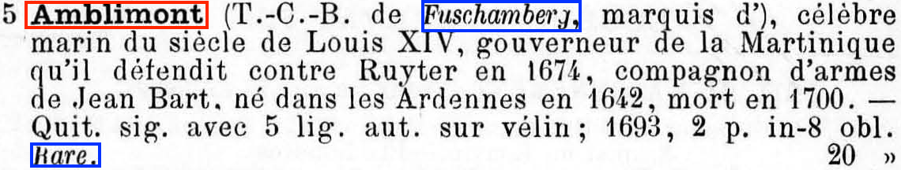

# OCRcat

Ground truths for 19th French auction and fixed-price catalogue

Models are created with [Kraken](http://kraken.re)

## Idea

Our idea is not only to provide high quality transcriptions of 19th c. catalogues, but also to keep typographical information such as bold (in red) and italic (in blue):



## Corpus

Data is taken from auctions catalogues published mainly in the second half of the 19th c. Two different kinds of data have been produced:
* Simple transcriptions
* Augmented transcriptions, encoding typographic informations such as bold and italic

## Data

For each catalogue, we provide:
* Images (`.png`)
* PageXML documents (`.xml`)
* Ground truth pairs (`.gt.txt` and `.png`)

Transcriptions are augmented of typographic information with different technics:
* EXTRACTED_1: bold and italic are tagged with HTML tags (`<b>`, `</b>`, `<i>` and `<i>`)
* EXTRACTED_2: bold and italic are tagged with simple tags (`_`, `#`)
* EXTRACTED_3: bold and italic are tagged with chinese caracters (`传`, `磨`)
* EXTRACTED_4: bold and italic are tagged with chinese caracters (`传` and `见` for bold, `磨` and `折` for italic)
* EXTRACTED_5: bold and italic are not marked
* EXTRACTED_6: bold and italic are marked with a mask (`bbb` for bold, `iii` for italic, `nnn` for normal, `ccc` for italic and bold)


## Structure of the repo

```
|-SCRIPTS
  |-cleaning.sh
  |-restoring_HTML_markup.py
|-MODELS
  |-TRAIN_1
    |-eval.txt
    |-test.txt
    |-train.txt
    |-report.txt
    |-model.mlmodel
  |-TRAIN_2
    |-…
  |-TRAIN_3
    |-…
  |-TRAIN_4
    |-…
  |-TRAIN_5
    |-…
|-DATA
  |-CATALOGUE_1
    |DATA
      |-page_1.html
      |-page_2.html
      |-…
    |–IMAGES
      |-page_1.png
      |-page_2.png
      |-…
    |-LINES
      |-page_1_line.xml
      |-page_2_line.xml
      |-…
    |-PAGES
      |-page_1.xml
      |-page_2.xml
      |-…
    |-EXTRACTED
      |-item_1.gt.txt
      |-item_1.png
      |-item_2.gt.txt
      |-…
  |-CATALOGUE_2
  |-…
|-DATA_typographic
  |-CATALOGUE_1
    |DATA
      |-page_1.html
      |-page_2.html
      |-…
    |–IMAGES
      |-page_1.png
      |-page_2.png
      |-…
    |-LINES
      |-page_1_line.xml
      |-page_2_line.xml
      |-…
    |-PAGES
      |-page_1.xml
      |-page_2.xml
      |-…
    |-EXTRACTED_1
      |-item_1.gt.txt
      |-item_1.png
      |-item_2.gt.txt
      |-…
    |-EXTRACTED_2
      |-item_1.gt.txt
      |-item_1.png
      |-item_2.gt.txt
      |-…
    |-EXTRACTED_3
      |-item_1.gt.txt
      |-item_1.png
      |-item_2.gt.txt
      |-…
    |-EXTRACTED_4
      |-item_1.gt.txt
      |-item_1.png
      |-item_2.gt.txt
      |-…
    |-EXTRACTED_5
      |-item_1.gt.txt
      |-item_1.png
      |-item_2.gt.txt
      |-…
    |-EXTRACTED_6
      |-item_1.gt.txt
      |-item_1.png
      |-item_2.gt.txt
      |-…
  |-CATALOGUE_2
  |-…
```

## Contribute
If you want to contribute training data or models, you can do so by cloning the repository and sending us a pull request, or by sending an email at simon.gabay(at)unine.ch.

## Literature
TO BE ADDED

## Cite this repository
Simon Gabay and Ljudmila Petkovic (éd.), _19th fixed-price and auction catalogues: Ground Truth and Models for OCR_, Neuchâtel: Université de Neuchâtel, 2020, [https://github.com/katabase/OCRcat](https://github.com/katabase/OCRcat).

Please keep me posted if you use this data! simon.gabay(at)unine.ch

## Contact
simon.gabay[at]unine.ch

## Thanks
Special thanks to Thibault Clérice for his magic xslt stylesheets (and many other things)!

## Licence
<a rel="license" href="http://creativecommons.org/licenses/by/4.0/"></a><br />Ce travail est mis à disposition selon les termes de la <a rel="license" href="http://creativecommons.org/licenses/by/4.0/">Licence Creative Commons Attribution 4.0 International</a>.
